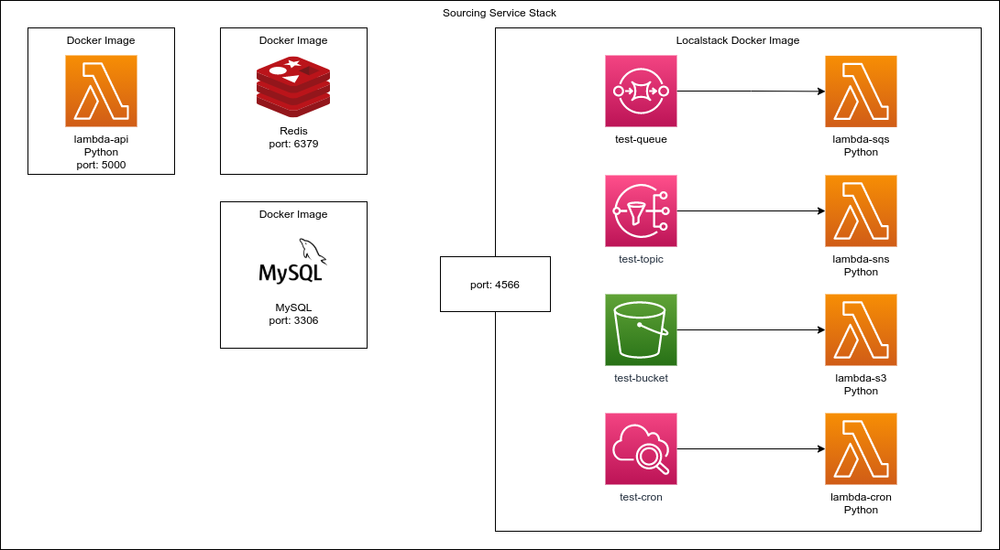

# template-serverless-lambda-python
This project contains isolated examples of AWS Lambda Services as well this provide
a stack example.

## Service Architecture
Example of architecture of this project stack.


## Service Stack
Example of components of the architecture of this project.


## Build environment script workflow
Example of the workflow to create the environment.


## Single project examples

You can find light examples:
* [Lambda API Light](./examples/lambda_api_light)
* [Lambda CRON Light](./examples/lambda_cron_light)
* [Lambda SQS Light](./examples/lambda_sqs_light)
* [Lambda SNS Light](./examples/lambda_sns_light)
* [Lambda S3 Light](./examples/lambda_s3_light)
* 
You can find complex examples:
* [Lambda API](./examples/lambda_api)
* [Lambda API RESTful](./examples/lambda_api_restful)
* [Lambda CRON](./examples/lambda_cron)
* [Lambda SQS](./examples/lambda_sqs)
* [Lambda SNS](./examples/lambda_sns)
* [Lambda S3](./examples/lambda_s3)


## Stack
* AWS Lambda
* Flask for APIs
* Custom code based in AWS Chalice for SQS, SNS, S3 and CRON

## Prerequisites
* Docker
* Docker-compose
* Python 3.x

## Installation
### Creating the virtual env
To create the venv and install the modules execute:
```bash
./scripts/venv.sh
```

### Running via docker
To execute the build:
```bash
./scripts/runenv.sh --build
```
Execute the follow command:
```bash
./scripts/runenv.sh
```
### Boot the resources
Execute the follow command:
```bash
./scripts/boot.sh
```
